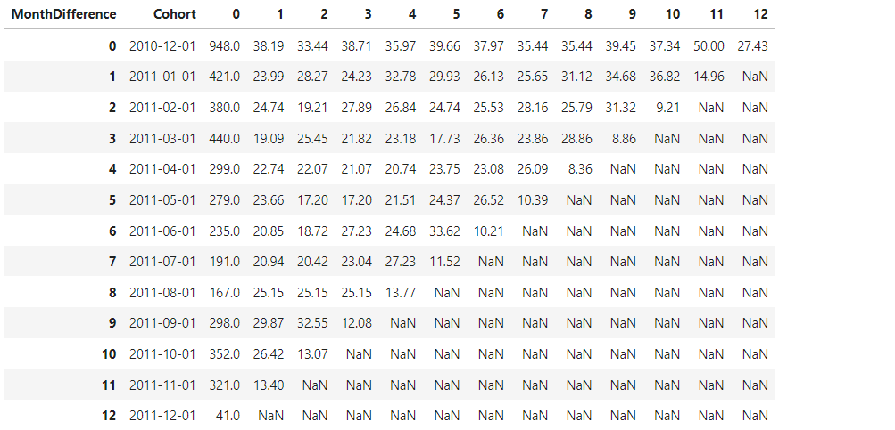
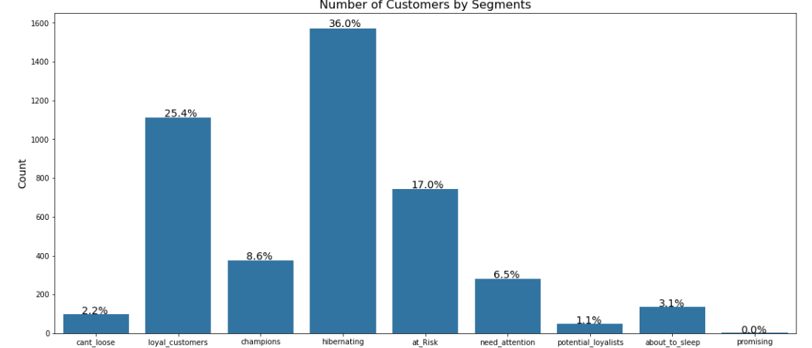
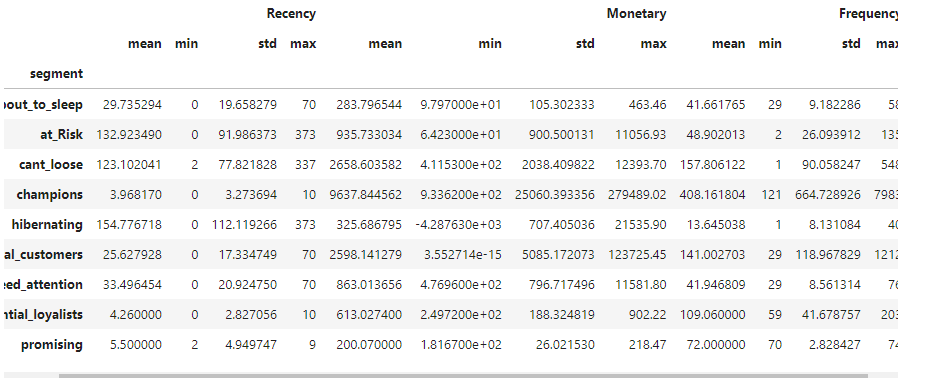

# Data Science Portfolio

## About Me
I am a passionate data scientist with experience in machine learning, data analysis, and cloud deployment. I enjoy exploring data, deriving insights, and building predictive models to solve real-world problems.
I have expertise in solving business problems through data driven insights using tools like Python, SQL, Pyspark, R, Hive, Hadoop, along with visualisation tools like Tableau. Currently, I am pursuing MS in Computational Data Science at Georgia Tech. Before coming to Georgia Tech, I have 6 years of experience working in analytics and data science field. I have worked with Credit Suisse(Counterparty Credit Risk) and Airtel (Credit Risk). I have graudated from IIT Guwahati with a degree in Chemical Engineering.

## Education
- MS Data Science, Georgia Tech 
- B.Tech. Chemical Engineering, IIT Guwahati

## Experience
Data Scientist at Airtel (Apr 2022 - July 2023)
- Implemented predictive scorecard model with decision tree algorithm to enhance collections processes, resulting in a 15% efficiency improvement.
- Spearheaded fraud identification mechanism integration, reducing fraud rates by 30% and safeguarding the platform.
- Led A/B testing initiatives for optimizing lead allocation, achieving a 20% increase in average ticket size.
- Utilized advanced statistical techniques to target high-value customer segments, leading to a 20% increase in disbursals.
- Developed dynamic Tableau dashboards for real-time tracking of credit risk and fraud indicators.
- Recognized with STAR employee award for outstanding performance, reflecting top 4% status among Airtel Financial Services employees.

Lead Analyst at Xiaomi (Aug 2021- Mar 2022)
- Established data and reporting infrastructure utilizing SQL, enabling real-time insights into product, marketing funnels, and business KPIs.
- Developed root cause reports to address customer conversion issues, resulting in a significant 40% increase in conversions.
- Innovated risk management strategies by devising a trade matching algorithm, enhancing risk metrics computations and decision-making processes.

Quantitative Analyst at Credit Suisse (Jan 2019- Aug 2021)
- Led backtesting of the Bank’s IMM models, identifying critical weaknesses and contributing to model development and validation.
- Utilized advanced statistical techniques to measure model performance, ensuring regulatory compliance and risk mitigation.

Market Analyst Futures Trader (Jul 2017- Dec 2018)
- Conducted comprehensive market research using a multifaceted approach to formulate effective trading strategies.
- Leveraged a combination of fundamental analysis and technical indicators to generate innovative trading ideas.

  
## Projects

### [Project 1: Classification and Cloud Deployment](https://github.com/karan2909/Churn_deployment_heroku)
- Developed a Machine Learning Model to predict Employee Attrition using various algorithms.
- Conducted exploratory data analysis using data visualization techniques.
- Achieved good recall on the 'IBM HR Analytics Employee Attrition & Performance' dataset from Kaggle, using Logistic Regression.
- Implemented a WEB API using the Flask framework and deployed it on the Heroku cloud platform.
- Dataset Link: [IBM HR Analytics Employee Attrition & Performance](link_to_dataset)

### [Project 2: Crime Prediction in Atlanta](https://github.com/karan2909/Churn_deployment_heroku)
- Developed a Machine Learning Model to predict crime in Atlanta.
- Conducted exploratory data analysis and utilized various data visualization techniques.
- Crime clustering utilizing GMM algorithm with latitude and longitude data.
- Geographical clusters receive risk scores indicating crime severity, offering monthly and yearly risk profiles.
- Time series modeling, specifically Exponential Smoothing, employed to forecast crime risk scores from 2019 to 2020 using data spanning 2009 to 2018.
- Visualization of results on an interactive map of Atlanta.

### [Project 3: Causal Inference](https://github.com/karan2909/Causal_Inference)
- Causal inference techniques, specifically the CausalImpact model, are applied to the preprocessed data to estimate the causal effect of the promotion on sales. This involves comparing the observed sales data during the promotion period with counterfactual sales data derived from similar stores without promotions.
- The results of the causal inference analysis are evaluated to determine the significance and magnitude of the causal effect. Statistical metrics and visualizations are utilized to interpret the findings and draw actionable insights.

### [Project 4: A/B Testing](https://github.com/karan2909/A-B-Testing)
- To access impact of UI change on CTR.

### [Project 5: Customer Segmentation and Retention](https://github.com/karan2909/ECom--Retention-and-Segmentation)
- To find segmentation of customers for their online store for promotions/discount.

## 1) Feature Engineering
- RFM Features: Recency, Tenure, Frequency, Monetary.
- Product Diversity: Number of Products Purchased.
- Behavioral Features: Average Days Between Purchases, Favorite Day for Shopping.
- Geographical Features: Is from UK or not.
- Cancellation Features: Canceled Flag, Number of canceled orders.

## 2) Retention

## 3) Customer Segmentation - Heuristic and Kmeans
Customers are segmented into different clusters based on:
- Recency: How recently they did the transaction.
- Frequency: How often the customers are doing transactions.
- Monetary: Average Order Value per customer basket.

### [Project 6: Customer Acquistion](https://github.com/karan2909/Customer_Acquistion)
- Classification project to determine which customers should be targeted.

### [Project 7: Time Series](https://github.com/karan2909/Time_Series)
- Failure Prediction using Time Series
